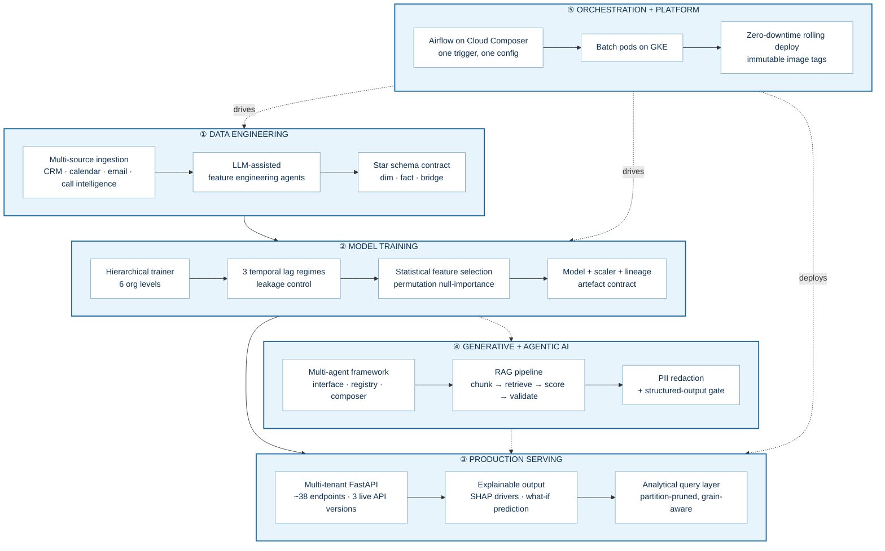
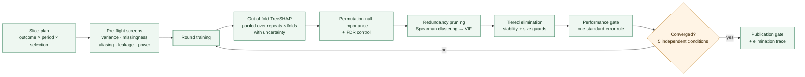
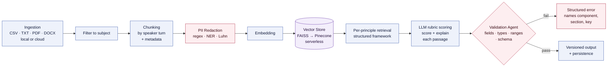
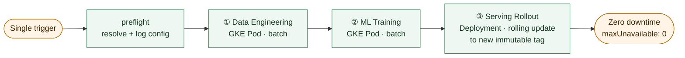

<div align="center">


<a href="https://github.com/jhhalls">

</a>

<br/>


<br/><br/>

<a href="https://www.linkedin.com/in/rohit-raj-jalheria/"></a>
<a href="TWITTER_URL"></a>
<a href="WEBSITE_URL"></a>
<a href="BLOG_URL"></a>
<a href="mailto:EMAIL_ADDRESS"></a>


</div>

---

## 👋 Who I Am

I'm an **AI/ML engineer** with **4+ years** of experience. For the last two of them I've been the
**owning engineer** of the machine-learning and generative-AI platform behind a B2B
revenue-intelligence SaaS product — the training pipeline, the multi-tenant serving API, the AI
agents, and the orchestration that ties them together.

Not a contributor to someone else's platform. The author of it. Authorship across that codebase
is verifiable by line-level `git blame` attribution rather than asserted — **~95% of a ~40K-line
production serving codebase**, **100% of its ~25K-line service layer**, **~32K lines of AI
agents**, and the orchestration platform.

What I think actually distinguishes the work isn't its size. It's what happens when it breaks,
and whether anyone can tell if the model is right.

> **A note on what you'll find here:** my production work lives in private repositories, so this
> profile *describes* systems rather than linking to them. Everything below is written at the level
> of transferable engineering — architecture, technique and judgement — with proprietary specifics
> deliberately generalised.

<div align="center">
<a href="https://github.com/jhhalls/engineering-portfolio">

</a>
</div>

---

## 🧭 What I Build

A single platform, owned end to end — from raw CRM exports to an explainable prediction in front
of a sales manager.



---

## 🏗️ Systems I've Built

*Each section expands. Collapsed, it's a scan; expanded, it's the whole story.*

<details>
<summary><b>◾ Production ML Serving Platform</b> — multi-tenant · explainable · ~95% mine by line attribution</summary>

<br/>

**The problem.** Model-derived coaching insight was locked in analyst notebooks. It needed to be
served live, per tenant, per persona — rep, manager, executive — across a fiscal-quarter timeline.

**What it is.** A multi-tenant FastAPI platform exposing **~38 endpoints** that serve SHAP-based
driver rankings, what-if outcome predictions and generated coaching insight to enterprise revenue
teams. Containerised, running on Google Cloud Run, serving multiple enterprise tenants from a
single deployment.

**Ownership.** ~95% of the ~40K-line serving surface, and **100% of the ~25K-line service layer**,
by `git blame` line attribution. Also 98% of the test suite.

#### The engineering that mattered

| Challenge | What I did |
|---|---|
| **A monolith behind a live API** | **Strangler-fig migration** of a ~7.7K-line logic monolith into **17 tested, config-driven service modules** — both paths imported side by side through cutover, behaviour guarded by a cross-version parity harness. No consumer regression. |
| **Three API versions live at once** | Unified every rejection behind one coded envelope — `{error, code, field, received, schema_version}` — **scoped by path prefix** so v1 consumers stayed untouched. Relocated routes ship as deprecation-logged aliases on the same handler, never as a breaking change. |
| **Silent misconfiguration reaching prod** | A **fail-fast config loader with no defaults and no silent fallbacks**. A missing, null or mistyped key raises naming its *exact dotted path*. `bool` is explicitly rejected where a number is expected. Config resolves relative to the module file, so behaviour never depends on the process working directory. |
| **Generic 500s with no root cause** | A **30-code error framework** with a *top-down diagnostic ladder* walking the storage hierarchy — destination → level → combination → entity → period → artefact — so a production failure names **the first missing artefact** instead of a shrug. |
| **Many tenants, one container** | Tenant resolved **per request from a header** with fail-fast rejection and no hardcoded default; each tenant isolated to its own storage namespace. Rolled out across **five enterprise customer configurations** with differing schemas and fiscal calendars. |
| **Sync ML work on an async service** | Every v2/v3 route offloads blocking ML and dataframe work **off the event loop**, with the executor explicitly sized rather than inherited. |

`FastAPI` · `Starlette` · `asyncio` · `scikit-learn` · `SHAP` · `pandas` · `PyArrow` · `DuckDB` ·
`MongoDB` · `Cloud Run` · `Docker` · `pytest`

</details>

<details>
<summary><b>◾ Statistical Feature-Selection Agent</b> — ~14K lines, sole author · <i>no LLM in the decision path</i></summary>

<br/>

**The problem.** Deciding which drivers survive into a model was a manual, unrepeatable analyst
judgement made by eyeballing a SHAP bar chart.

**The insight that drove the whole design.** "Which drivers have the smallest SHAP?" is a question
that **always has an answer** — feed it pure noise and it will still confidently rank one driver
last and drop it. There is no state in which that procedure says *"none of these matter."*

So I changed the question to: *"which drivers have importance indistinguishable from a driver with
no relationship to the outcome?"* — a question that **can** correctly answer *"none of them."*

**The explicit architectural constraint: there is no LLM anywhere in the decision path.** Every
elimination names its rule, test statistic, threshold and round, because every one has to be
defensible to an analyst who disagrees with it.

#### The method



**Trust measures.** Bootstrap rank stability and SHAP direction-consistency per driver. Seeded,
per-round reproducible artefacts. An `elimination_trace` that answers *why was this dropped, in
which round, by which test, and how far from the threshold?*

**Numerical parity.** Nine tests assert agreement with the incumbent production trainer **to
1e-12** — so any difference in output is attributable to the method, not to a reimplementation bug.

**Honest status.** Fully implemented and covered by ground-truth tests; its statistical stages are
verified against **synthetic data only** and its deployment is configured but not yet live. The
measurement stage against real data may force threshold retuning. *I'd rather say that than call it
production.*

`scikit-learn` · `SHAP` · `SciPy` · `NumPy` · `Cloud Run Jobs` · `Cloud Build` · `Secret Manager`

</details>

<details>
<summary><b>◾ ML Evaluation Framework</b> — champion/challenger · <i>selection</i> and <i>stability</i> metrics</summary>

<br/>

I didn't ask anyone to take the agent above on faith. Four things made the claim checkable:

**① Ground truth.** Five seeded synthetic generators with **known support**, each modelling a
failure mode the manual process cannot detect — `pure_noise`, `sparse_signal`, `correlated_block`,
`multiplicative_identity`, `gate_binding`. Each is reproducible from its index alone, and each
frame is shaped *exactly* like a real slice so it feeds the system end to end with no special-casing.

**② The right metrics.** Precision, recall, F1, false-discovery proportion, exact recovery — and
critically, **stability**: Nogueira's index, the Kuncheva index, mean Jaccard across replicates.
Picking the right drivers once isn't enough; it has to pick them *again*.

**③ A fair baseline.** The incumbent heuristic **transcribed exactly**, with source line citations —
same split, same seed, same scaler, same model selection, same in-sample SHAP, same threshold. Not
approximated, *because it's the arm the business actually cares about*.

**④ Testing the test itself.** A calibration protocol asking: **are the p-values actually
p-values?** Under the global null they should be Uniform(0,1) — but with `B` permutations the
attainable values lie on the grid `1/(B+1), 2/(B+1), …`, which makes a naive KS test conservative at
small `B`. The protocol reasons about **both** failure directions: conservative p-values mean the
significance tier never certifies anything and a lower tier silently carries every round;
anti-conservative ones mean real drivers get eliminated as noise. **Neither is visible from the
output artefacts** — which is exactly why it needed its own test.

Plus a tiered run-artefact QA CLI grading every check `PASS` / `WARN` / `FAIL` / `N/A`.

</details>

<details>
<summary><b>◾ Multi-Agent RAG Pipeline</b> — framework first, agents second</summary>

<br/>

**I wrote the framework before I wrote the agents.** An abstract agent interface with state-passing
execution (`run(state) → state`), an agent registry, a sequential pipeline composer, and a
structured-JSON logging layer emitting timestamp, level, agent name, subject and per-step duration —
so every run is traceable stage by stage.

On that foundation: **7 agents · 4 orchestrations · 8 pipeline nodes**, a CLI, and a metrics/tracing
module.



**An architectural migration I drove:** from an in-process FAISS index to **Pinecone serverless**
over gRPC, and from static local files to dynamic cloud-storage ingestion.

**Privacy engineering.** A hybrid PII detector — regex patterns, **spaCy NER** as an optional
dependency that degrades gracefully when absent, and **Luhn checksum validation** for card numbers
to suppress false positives on any 16-digit sequence. Three configurable strategies: full masking,
tokenisation, and **salted BLAKE2b hashing** for values that must stay *pseudonymous but joinable*.
Works on both strings and dataframes.

**Honest framing.** The pipeline went through **21 tracked versions** while retrieval strategy,
chunking and vector store changed underneath. The stable artefact isn't the version series — it's
the framework beneath it, which barely changed across all 21. I don't describe the series as
production code.

`LangChain` · `Google Gemini` · `Pinecone` · `FAISS` · `spaCy` · `PyMuPDF` · `MongoDB`

</details>

<details>
<summary><b>◾ LLM-Assisted Feature-Engineering Agents</b> — <i>deterministic code decides, the model plans</i></summary>

<br/>

Two tenant variants, **~10.5K lines, sole author**, deployed as scheduled batch Cloud Run Jobs.

**The flow.** Discover CRM exports in object storage → profile the schema (column type inference +
statistics) → use **Gemini 2.0 Flash to *plan*** which features to derive → compute them
**deterministically in pandas** → publish the feature set plus a JSON manifest → report to Slack via
Block Kit. Eleven orchestrated steps; any fatal step raises a red Slack alert and exits non-zero.

**The design rule I applied across every agent I've built:**

> A deterministic catalogue makes the decision. The model **plans, drafts and augments**.

The contrast with the statistical agent above is deliberate, and it's the judgement call I'd most
want to be asked about: there, an LLM is banned from the decision path because every elimination
must survive audit. Here, the LLM *does* have a job — planning features from an unfamiliar schema is
exactly the open-ended, judgement-shaped task it's good at. **Knowing which of those two shapes a
problem needs is most of the work.**

**Engineering hygiene.** Prompts centralised in **version-controlled YAML** behind a loader, never
embedded in code. All agent I/O typed with **Pydantic** models and enums. Business context is
authored configuration with its own authoring specification.

Feature targets: deal win probability · deal velocity · churn signals · rep performance benchmarking.

</details>

<details>
<summary><b>◾ Star Schema + Filterable Analytics Engine</b> — I own both halves</summary>

<br/>

I designed and own **both** the pipeline that publishes the data model *and* the serving layer that
queries it. That vertical ownership is what made the correctness properties below possible.

#### Three tables, and why

> **"Measures of different grain must never share a table. Flatten an opportunity-level measure
> onto a finer grain and every `SUM` fans out, multiplying bookings by the row count."**

| Table | Grain | Serves |
|---|---|---|
| `dim_rep` | rep × quarter | rep-grain facets — tenure, segment, geo, manager ladder |
| `fact_opportunity` | opportunity | deal-grain facets — amount, won/lost/open, deal attributes |
| `bridge_rep_period` | rep × quarter | **the cheap path** — pre-rolled measures, so a tenure filter answers here *without touching the opportunity fact* |

#### Four decisions worth stealing

**① Partition pruning is a path property, not a predicate.** Entity, year and quarter are substituted
into the **object path**, never into a `WHERE` clause. The engine opens exactly one entity's quarter,
so **latency tracks the size of one slice rather than the size of the warehouse.**

**② Measures are components, never stored ratios.** Every measure comes back as numerator and
denominator. That's what makes a filtered view **reconcile exactly** to the unfiltered one — and why
a win rate stays correct when slices are combined. Most dashboards get this wrong.

**③ Grain-aware query planning.** A facet's *declared grain* selects the plan. Adding a new filter is
a config entry plus a pipeline column — **no serving code change**.

**④ Config as an enforced contract.** Every raw source column name, rename, dtype, value map, bucket
edge, period rule and validation threshold lives in config — and **a test fails the build if any
source column literal appears in pipeline code.**

**Safety.** Atomic publish: a blocked run publishes *nothing*, so the last good grid stays served.
A `--dry-run` validates and writes nothing. A full local end-to-end path runs on generated fixtures
with no cloud credentials.

`DuckDB` · `Parquet` · `Hive-style partitioning` · `Cloud Storage` · `pandas`

</details>

<details>
<summary><b>◾ Hierarchical ML Training Pipeline</b> — 6 org levels · config-declared model families</summary>

<br/>

One model per **(entity × quarter × outcome)**, across six organisational levels — rep, individual
manager, manager-aggregate, geography, cohort and executive — for multiple enterprise tenants with
differing schemas and fiscal calendars.

**The training core.** LinearRegression + RandomForest, 80/20 split, `StandardScaler` fitted on train
only, SHAP and feature importances, best-model selection by lowest **MAE with R² as tie-break**;
persisting model, scaler, the *exact* training rows, correlation summaries, coefficients and
per-outcome scores.

**The generalisation I'm proudest of.** Every existing level read one shared input and differed only
by grouping. Executive-level questions each needed a *different input source* and a *different
feature set*. Rather than fork the trainer, I turned the level into a **configuration-declared
family of model combinations** — each declaring its own input, features, grouping keys and a
`min_rows` threshold triggering a documented fallback. **Four combinations shipped without changing
the training core.**

**Model data lineage — my own initiative.** The motivation, from my own ticket:

> *"We have no record of how each model's training data was selected, so results cannot be traced back."*

Every combination now writes a lineage artefact recording input source, population, grouping keys,
feature source, `min_rows`, lag regime, imputation setting and periods — then per-entity row counts
and below-threshold flags — then a **full nulls-per-column census of the input**.

**Leakage control.** Three lag regimes: none, a 90-day lag (drivers from the prior quarter against
current-quarter outcomes), and **per-driver multi-lag** — with the lag configuration and driver name
mapping persisted as first-class artefacts beside the models.

**Imputation with provenance.** Optional null imputation writes `_isimputed` flag columns alongside,
and imputed inputs persist *separately* from raw — so every training run is reconstructable.

</details>

<details>
<summary><b>◾ Reliability & Production Debugging</b> — the part I enjoy most</summary>

<br/>

#### A concurrency defect that monitoring couldn't see

Analytics-backed routes on a serving instance began hanging until the gateway timeout — permanently,
for that instance — while request-validation rejections on the *same instance* still returned in
milliseconds.

**My first hypothesis was wrong.** That asymmetry looks exactly like request queueing: validation
runs before the handler, so cheap rejections would still return fast behind a saturated pool. It was
*also* true — there really was a queueing problem — but it was not what caused the permanent hang.

**The real cause.** A **shared embedded-query-engine connection**. The handle holds exactly *one*
pending-result slot, so two request threads calling `execute()` on it corrupt it **unrecoverably** —
every subsequent query on that connection fails or hangs. I reproduced it deterministically by
simulating a single UI page load firing three routes in parallel.

**The fix, and why that fix.** One database per process, **one cursor per thread**. The obvious
alternative — a connection per thread — also fixes the corruption, but throws away the shared buffer
pool and catalog tables, so every thread pays cold reads. **A cursor is a new connection onto the
*same* database**, so the warm path survives. The cost: registered views become connection-local, so
a thread can only query what it bound in the same call chain — which I wrote down as an explicit rule
for whoever touches it next. Plus a lock around `CREATE TABLE`, because concurrent DDL across cursors
can raise a catalog write-write conflict; the DDL is rare and idempotent, so the lock is free.

**And the queue I found on the way.** The async runtime sizes its default executor at
`min(32, cpu_count + 4)` — **six threads on a two-vCPU instance** — while the serving platform was
admitting **sixteen** concurrent requests to it. The ten with no thread wait in an in-process queue
that **appears in no metric**, and can reach the gateway timeout *having never executed a line of
handler code*. The platform had already decided how many requests the instance takes; queueing them
a second time inside the process only hides where the time went. The executor is now sized from
configuration, kept at or above platform concurrency, and drained on shutdown.

> **The lesson worth keeping:** two plausible causes were both real, and only one explained the
> *permanence*. I wouldn't have separated them without a deterministic reproduction — and I wrote the
> correction of my own first hypothesis into the code, for the next person.

#### Other reliability work

| Problem | Fix |
|---|---|
| A transient storage `503` during an upload **discarded an entire training run** | Verified by exhaustive search that *all* storage I/O flowed through exactly **three functions**, with zero direct client calls anywhere else — then added config-driven **exponential backoff with jitter** at those three points, making **~85 upload sites and every read** resilient **in one change**. |
| No entity was ever "complete" mid-run | **Inverted a quarter-outer loop to entity-outer** so each of ~400 managers per quarter trains end to end and flushes immediately. |
| Global summaries only appeared at the very end | **Cumulative per-quarter snapshot flush**, with the final snapshot **byte-for-byte identical** to the previous single end-of-run write — and the heavier loop-split alternative documented as *rejected, and why*. |
| Wall-clock = sum of all training profiles | **Bounded parallel execution** — but only after solving the two silent-corruption hazards it exposed: shared working-directory scratch paths, and colliding environment-level output paths. |
| A model combination silently skipped before training | Found an **imputation gate comparing a combination's columns against the *global* feature set** instead of its own override — so a valid combination was dropped with "no predefined drivers" before training ever began. |

</details>

<details>
<summary><b>◾ Airflow-on-Kubernetes Orchestration Platform</b> — ~95% mine</summary>

<br/>

One Airflow DAG on Cloud Composer running **three pipelines in sequence from a single trigger**,
driven by **one master configuration file**.



#### Decisions I made and wrote down

- **Batch stages are Pods; the serving stage is a Deployment.** A long-running API doesn't
  "redeploy" as a one-shot pod — it **rolls** to a new **immutable image tag** (git SHA / build id).
  That's the auditable standard, and `maxUnavailable: 0` makes it zero-downtime.
- **A dedicated GKE cluster** keeps heavy data/ML pods off the orchestrator's own scheduler.
- **Workload Identity everywhere — no static key files anywhere.** Plus namespace isolation and RBAC
  scoped to let the orchestrator roll out *exactly that one Deployment*.
- **The master config is the service layer.** Shared values declared once and referenced by
  substitution, then **resolved and validated at DAG parse time** — so a bad config fails *loudly in
  the UI* rather than halfway through a run.
- **The orchestrator invokes pre-built containers and never modifies the three pipeline repos.**
- **HPA**: CPU target 70%, 2–10 replicas, with a **300-second scale-down stabilisation window** to
  damp flapping.
- **A local-parity path** runs the same DAG under Docker on a laptop.

**Documentation pack authored:** a 10-page technical design, a 4-page design-and-decisions document,
a 4-page Kubernetes walkthrough, three architecture diagrams, and a **self-contained interactive
animation** of a pipeline run with streaming logs and a live rolling-update view.

</details>

<details>
<summary><b>◾ Engineering Process</b> — how the work gets specified, reviewed and proven</summary>

<br/>

I introduced a written specification process across the platform, and it's as much a part of the work
as the code:

- **46 paired dev/QA tickets** in a numbered story hierarchy, each carrying *Title · Description ·
  Problem · Solution · Scope · Out-of-scope · Deliverables · Open items · Status* — with an explicit
  **"for approval before any code is written"** gate.
- **QA tickets specify executable acceptance criteria**: corner cases, regression diffs, and
  **byte-for-byte equivalence** requirements for behaviour-preserving refactors.
- A **17-section technical specification** covering scope boundaries, handoff contract, statistical
  method, convergence, configuration reference, artefact reference, compute budget, failure modes,
  governance/QA/audit, and **known trade-offs**.
- **7 UI/API contract documents** written for the frontend team to build against.
- A **9-epic, 6-sprint Agile backlog** cut as **vertical slices** — every story bundles its ML *and*
  API work so it's demoable end to end through a real scoped API response; every task tagged
  `[API]` `[ML]` `[Infra]` `[Data]` `[Test]` `[Demo]`; every story carries a one-line *"Demo:"* hook.

**A standard I set for the team:**

> Everything customer-specific must be **config-driven**, so onboarding a new customer is a
> **config entry, not a code change** — with a dedicated acceptance ticket that proves it by
> new-customer dry-run.

</details>

---

## 🧪 Principles I Actually Work By

<table>
<tr><td width="50%" valign="top">

**🔊 Fail loudly, never silently**
<br/><sub>No defaults. No silent fallbacks. A missing config key raises naming its exact path, because a default converts a deploy-time error into a *silent wrong answer in production*.</sub>

</td><td width="50%" valign="top">

**🤖 Deterministic code decides; the model plans**
<br/><sub>An LLM is right most of the time. That's the wrong tool for a decision that must be auditable *every* time — and the right tool for an open-ended planning task.</sub>

</td></tr>
<tr><td valign="top">

**📐 Grain before aggregation**
<br/><sub>Measures of different grain never share a table. Measures ship as numerator/denominator components, never stored ratios — so filtered views reconcile *exactly*.</sub>

</td><td valign="top">

**🧾 A model that can't be traced can't be trusted**
<br/><sub>Every model carries lineage: its input source, population, grouping, features, lag, imputation — and a full nulls-per-column census of what it trained on.</sub>

</td></tr>
<tr><td valign="top">

**🧬 Prove the replacement before replacing**
<br/><sub>Synthetic ground truth, an exactly-transcribed incumbent baseline, stability metrics — and numerical parity to **1e-12** before proposing anything replace anything.</sub>

</td><td valign="top">

**📝 Write down the decision *and* the rejected alternative**
<br/><sub>Including the time my first diagnosis of a production failure was wrong. The next engineer needs the reasoning, not just the result.</sub>

</td></tr>
</table>

---

## 🛠️ Tech Stack

<table>
<tr><td><b>Languages</b></td><td>


</td></tr>
<tr><td><b>ML &amp; Stats</b></td><td>


<br/><sub>Permutation null-importance · FDR control · out-of-fold TreeSHAP · VIF · Spearman clustering · one-standard-error rule · bootstrap stability · p-value calibration · Nogueira / Kuncheva / Jaccard stability indices</sub>
</td></tr>
<tr><td><b>GenAI &amp; Agentic</b></td><td>


<br/><sub>RAG · multi-agent architecture · agent registries · pipeline orchestration · embeddings · chunking strategies · prompt engineering · structured output · LLM-as-judge · agent evaluation · PII redaction</sub>
</td></tr>
<tr><td><b>Backend &amp; API</b></td><td>


</td></tr>
<tr><td><b>Data</b></td><td>


<br/><sub>Dimensional modelling · star schema · partition pruning · ETL/ELT · data contracts · data lineage · schema normalisation</sub>
</td></tr>
<tr><td><b>Cloud &amp; MLOps</b></td><td>


<br/><sub>Cloud Storage · Cloud Scheduler · Secret Manager · Cloud Composer · GKE · Cloud SQL · Workload Identity · structured logging &amp; observability</sub>
</td></tr>
</table>

---

## 📊 GitHub

<div align="center">

<picture>
  <source media="(prefers-color-scheme: dark)" srcset="https://github-readme-stats.vercel.app/api?username=jhhalls&show_icons=true&include_all_commits=true&count_private=true&hide_border=true&theme=tokyonight&title_color=00b4a6&icon_color=00b4a6" />
  
</picture>
<picture>
  <source media="(prefers-color-scheme: dark)" srcset="https://github-readme-stats.vercel.app/api/top-langs/?username=jhhalls&layout=compact&langs_count=8&hide_border=true&theme=tokyonight&title_color=00b4a6" />
  
</picture>

<br/>

<picture>
  <source media="(prefers-color-scheme: dark)" srcset="https://streak-stats.demolab.com?user=jhhalls&hide_border=true&theme=tokyonight&ring=00b4a6&fire=00b4a6&currStreakLabel=00b4a6" />
  
</picture>

<br/>


</div>

---

## 🎓 Mentoring &amp; Technical Communication

Before and alongside the engineering, I've worked as a **Data Science Mentor** — guiding learners
and working professionals into the field.

That experience shows up directly in how I build now: the **46 paired dev/QA tickets**, the
**17-section specification**, the **7 API contract documents** written for another team to build
against, the **stakeholder design documents** and the **interactive pipeline walkthrough** built for
non-engineers. Specifications I write are meant to be *executed by someone else*.

I care about making complex systems legible — to juniors, to product partners, and to the engineer
who inherits the code at 2am.

---

## 🔭 Currently

```text
▸ Building     Agentic automation of the end-to-end data-science workflow —
               driver discovery → feature engineering → statistical selection → publication
▸ Exploring    Graph-based agent orchestration · hosted LLM tracing/eval tooling ·
               retrieval beyond dense-only (reranking, hybrid search)
▸ Thinking     How do you *prove* an AI system is better than the process it replaces?
               Ground truth, stability, and calibrated uncertainty — not vibes.
▸ Open to      Senior AI Engineer · Senior ML Engineer · AI/ML Engineer ·
               GenAI / Agentic AI Engineer  —  remote (India) or onsite (Europe)
```

---

## 🤝 Connect

<div align="center">

<a href="LINKEDIN_URL"></a>
<a href="TWITTER_URL"></a>
<a href="WEBSITE_URL"></a>
<a href="BLOG_URL"></a>
<a href="mailto:EMAIL_ADDRESS"></a>

<br/><br/>

<i>Let's turn data into systems, and systems into decisions people can trust.</i>


</div>
