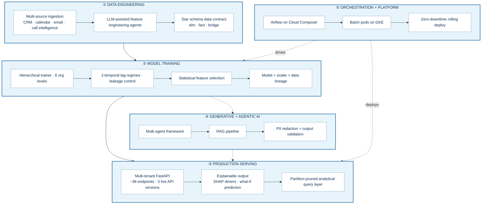

<div align="center">

# Engineering Portfolio — Rohit Raj Jalheria

**AI/ML Engineer** · Production ML Platforms · Generative &amp; Agentic AI · Google Cloud

<sub>A detailed, confidentiality-reviewed capture of two years owning the ML and GenAI platform<br/>
behind a B2B revenue-intelligence SaaS product.</sub>


</div>

---

## About this document

This is a **confidentiality-reviewed** portfolio of engineering work. It describes capability,
architecture and judgement at the level of **transferable engineering skill**, and deliberately omits
proprietary specifics: customer identities, colleague identities, internal repository, branch, module
and file names, infrastructure identifiers, credentials, internal URLs, and unreleased product detail.

Where a figure would expose a private codebase's exact dimensions it is given as an approximation.
Where work is a prototype, a design, or not yet deployed, **it says so**. Nothing here is claimed as
production unless it runs in production.

**Ownership is established by line-level `git blame` attribution across verified author identities**,
not by repository membership — so "I own this" means "these lines are mine", not "I had access".

---

## Table of contents

1. [Positioning](#1-positioning)
2. [The platform at a glance](#2-the-platform-at-a-glance)
3. [Production ML serving platform](#3-production-ml-serving-platform)
4. [Reliability and production debugging](#4-reliability-and-production-debugging)
5. [Hierarchical ML training pipeline](#5-hierarchical-ml-training-pipeline)
6. [Statistical feature-selection agent](#6-statistical-feature-selection-agent)
7. [ML evaluation framework](#7-ml-evaluation-framework)
8. [Multi-agent RAG pipeline](#8-multi-agent-rag-pipeline)
9. [LLM-assisted feature-engineering agents](#9-llm-assisted-feature-engineering-agents)
10. [Star schema and filterable analytics engine](#10-star-schema-and-filterable-analytics-engine)
11. [Airflow-on-Kubernetes orchestration platform](#11-airflow-on-kubernetes-orchestration-platform)
12. [Data engineering contributions](#12-data-engineering-contributions)
13. [Platform scaling design and delivery planning](#13-platform-scaling-design-and-delivery-planning)
14. [Engineering process and technical communication](#14-engineering-process-and-technical-communication)
15. [Skills, with evidence](#15-skills-with-evidence)
16. [What I have not done](#16-what-i-have-not-done)

---

## 1. Positioning

I'm an AI/ML engineer with **4+ years** of professional experience. For the last two I've been the
**owning engineer** of the machine-learning and generative-AI platform behind a B2B
revenue-intelligence SaaS product — training pipeline, multi-tenant serving API, AI agents, and the
orchestration between them.

**The through-line:** I take models from a training pipeline to a production API, and then I own them
in production — including the parts that break at 2am, and including the question of whether the
model is actually right.

Two things I'd point at as representative:

- A **production concurrency defect** I traced past my own wrong first hypothesis down to a shared
  query engine's pending-result slot and an async executor sized below the platform's concurrency
  limit — a queue that appeared in no metric.
- Replacing the way the product chose its model drivers: an analyst eyeballing a SHAP bar chart
  became **permutation null-importance under false-discovery-rate control**, validated against
  synthetic ground truth and numerical parity to **1e-12** before I proposed it replace anything.

---

## 2. The platform at a glance



### Ownership summary

| Area | Scale | My share | Status |
|---|---|---|---|
| Production serving platform | ~40K lines, ~38 endpoints | **~95%** · service layer **100%** | **Production** |
| ML training pipeline | ~8.3K lines mine | Primary author of trainer, config, paths, retry, CLI | **Production** |
| Statistical selection agent | ~14K lines | **100%** | Built; verified on synthetic data; **not yet deployed** |
| ML evaluation framework | ~1.2K lines | **100%** | Internal tooling |
| Star-schema contract pipeline | ~6.3K lines | **100%** | **Production-supporting** |
| LLM feature-engineering agents | ~10.5K lines (2 variants) | **100%** | **Production-supporting**, scheduled batch |
| Multi-agent RAG pipeline | ~4.9K lines framework | **100%** | Prototype → internal pipeline |
| Orchestration platform | DAGs + full K8s manifest set | **~95%** | Built, documented, deployment-ready |
| Data engineering pipeline | 2 modules | **Contributor** | Production, team-owned |

---

## 3. Production ML serving platform

> **Status: Production.** Containerised on Google Cloud Run, multiple enterprise tenants from a
> single deployment.

### The problem
Model-derived coaching insight was locked in analyst notebooks. It needed to be served live — per
tenant, per persona (rep / manager / executive), across a fiscal-quarter timeline, with the
explanation attached to every number.

### Architecture

```
Request ──► header-resolved tenant ──► service module per product lens
                                            │
         ┌──────────────────────────────────┼───────────────────────────────┐
         ▼                                  ▼                               ▼
  pre-trained models             Parquet training data            partitioned star schema
  + fitted scalers               (object storage)                 (embedded query engine)
  + SHAP importances
         │                                  │                               │
         └──────────────────────────────────┴───────────────────────────────┘
                                            ▼
                       generation-keyed cache ──► response (+ coded errors)
                                            ▼
                              structured logging · per-stage timing
```

### Engineering highlights

**Strangler-fig migration of a live API.** A ~7.7K-line logic monolith sat behind an API already
serving three schema versions to live consumers. Rewriting wholesale wasn't available. So: both
paths imported side by side in the entrypoint, one method moved at a time into its own service
module, and a **cross-version parity harness** comparing old and new responses. **17 modules
extracted**, no consumer regression. The entrypoint carries a comment naming which method went
where.

**Fail-fast configuration.** A strict loader with **no defaults and no silent fallbacks**. A
missing, null or mistyped key raises an error naming its *exact dotted path*. `bool` is explicitly
rejected where a number is expected, to avoid `True`/`1` confusion. The config path resolves
relative to the module file rather than the process working directory, so behaviour never depends on
how the service was launched.

> **The reasoning:** a default converts a deploy-time error into a *silent wrong answer in
> production*. Friendlier at boot, far more expensive later.

**Coded errors with a top-down diagnostic ladder.** 30 hex error codes. Beyond the ordinary data
errors, a diagnostic ladder walks the storage artefact hierarchy level by level — destination →
level → combination → entity → sub-entity → artefact type → period → summary → mapping →
importances → correlations — so a production failure returns **the first missing artefact by name**
rather than a generic 500. The error object carries both a code and a detail payload, so the root
cause appears in the log *and* the response.

**Three API schema versions, one error contract.** A custom validation handler reshapes the
framework's raw 422 into the service's own `{error, code, field, received, schema_version,
request_received}` envelope — **scoped by path prefix** so v1 consumers are untouched.

> **The reasoning:** one class of problem returning two different shapes forces every client to carry
> two code paths to find out what it got wrong. Route relocations therefore ship as
> **deprecation-logged aliases on the same handler**, never as a breaking change.

**Multi-tenancy.** Tenant resolved **per request from a header**, fail-fast on missing or empty, no
hardcoded default, with a configured alias for local development. Each tenant is isolated to its own
storage namespace. Rolled out across **five enterprise customer configurations** with differing
schemas and fiscal calendars.

**Performance.** Every v2/v3 route offloads blocking ML and dataframe work off the async event loop.
Generation-keyed caching (below). Thread-pool parallel I/O. An admin endpoint clears the cache
wholly, by period, or clears-and-rewarms.

**Testing.** ~3.5K lines of pytest across endpoint, service and regression suites, plus a live
response harness and a dedicated **v1↔v2 parity** script.

**Stack:** `FastAPI` `Starlette` `uvicorn` `asyncio` `scikit-learn` `SHAP` `pandas` `NumPy`
`PyArrow` `DuckDB` `MongoDB` `Cloud Storage` `Cloud Run` `Cloud Logging` `Docker` `pytest`

---

## 4. Reliability and production debugging

> **Status: Production.** Dated, root-caused, and documented in the codebase — including the
> correction of my own first hypothesis.

### The concurrency defect

**Symptom.** Analytics-backed routes on a serving instance hung until the gateway timeout —
**permanently, for that instance** — while request-validation rejections on the same instance still
returned in milliseconds.

**The wrong hypothesis.** That asymmetry looks exactly like request queueing: validation runs before
the handler, so cheap rejections would still return fast behind a saturated pool. Plausible. Wrong —
and *also* independently true, which is what made it confusing.

**The real cause.** A **shared embedded-query-engine connection**. The handle holds exactly one
pending-result slot, so two request threads calling `execute()` on it corrupt it **unrecoverably**:
every subsequent query on that connection fails or hangs. Reproduced deterministically by simulating
a single UI page load firing three routes in parallel.

**The fix, and why that one.**

| Option | Fixes corruption? | Cost |
|---|---|---|
| One connection per thread | Yes | **Throws away the shared buffer pool and catalog tables — every thread pays cold reads** |
| **One cursor per thread** ✅ | Yes | A cursor is a new connection *onto the same database*, so the warm path survives. Cost: registered views become connection-local |

The constraint that choice imposes — a thread may only query what it bound in the same call chain —
is written down as an explicit rule for future contributors. A lock was added around `CREATE TABLE`,
because concurrent DDL across cursors can raise a catalog write-write conflict; the DDL is rare and
idempotent, so the lock costs nothing.

### The invisible queue

The async runtime sizes its default executor at `min(32, cpu_count + 4)` — **six threads on a
two-vCPU instance**. The serving platform was admitting **sixteen** concurrent requests to that same
instance. The ten with no thread wait in an **in-process queue that appears in no metric**, and can
reach the gateway timeout *having never executed a line of handler code*.

> **The reasoning:** the platform has already decided how many requests this instance takes.
> Queueing them a second time inside the process only hides where the time went.

The executor is now replaced at startup with one **sized from configuration**, kept at or above the
platform's concurrency setting, and drained on shutdown. The distinction between the event loop's
executor and the framework's separate thread limiter for sync endpoints is documented inline, because
it is exactly the kind of thing that causes this bug twice.

### Other reliability work

| Problem | What I did |
|---|---|
| A transient storage `503` during a model upload **discarded an entire training run** | Verified by exhaustive search that *all* storage I/O flowed through exactly **three functions**, with zero direct client calls anywhere else — then added config-driven **exponential backoff with jitter** for 429/500/502/503/504 at those three points. **~85 upload sites and every read made resilient in one change.** |
| No entity was ever "complete" mid-run; summaries for ~400 managers per quarter appeared only after everything finished | **Inverted a quarter-outer loop to entity-outer**: each manager trains end to end across all quarters, then flushes its summaries and scores immediately. |
| Global summary documents also appeared only at the end | Chose a **cumulative per-quarter snapshot re-upload**, with the final snapshot **byte-for-byte identical** to the previous single end-of-run write — and documented why I rejected the heavier alternative of splitting the shared loop per level. |
| Wall clock = the sum of all training profiles | Added **bounded parallel execution** with a configurable cap — but only after identifying and solving the two silent-corruption hazards it exposed: hundreds of writes to a working-directory-relative scratch path, and environment-level output paths letting two runs overwrite the same artefact. |
| A valid model combination silently skipped | Found an **imputation gate comparing a combination's columns against the global feature set** rather than its own override — so a combination whose columns legitimately differed was dropped with "no predefined drivers" *before training ever ran*. |

---

## 5. Hierarchical ML training pipeline

> **Status: Production.**

One model per **(entity × quarter × outcome)**, across **six organisational levels** — rep,
individual manager, manager-aggregate, geography, cohort and executive — for multiple enterprise
tenants.

**Training core.** LinearRegression and RandomForest, 80/20 split, `StandardScaler` fitted on train
only, SHAP and feature importances, best-model selection by **lowest MAE with R² as tie-break**.
Persists the model, the fitted scaler, the *exact* training rows, correlation summaries, model
coefficients and per-outcome MAE/R² scores into a config-named nested artefact layout.

**The generalisation.** Every existing level read one shared input and differed only by grouping.
Executive-level questions each needed a *different input source* and a *different feature set*.
Rather than fork the trainer, I turned the level into a **configuration-declared family of model
combinations**, each declaring:

- its own input data source and sub-level
- its own feature set (or an inherited default)
- its grouping keys — what a single model represents
- a `min_rows` threshold triggering a documented fallback path
- lineage settings

**Four combinations shipped** without changing the training core: reps-per-executive,
managers-per-executive, reps-per-cohort-per-executive, reps-per-manager-per-executive.

**Model data lineage — my own initiative.** The stated motivation, from my own specification:

> *"We have no record of how each model's training data was selected, so results cannot be traced back."*

Each combination now writes a lineage artefact recording input source, population, grouping keys,
feature source, `min_rows`, lag regime, imputation setting and periods; then per-entity row counts,
below-threshold flags and periods; then a **full nulls-per-column census of the entire input**.

**Leakage control — three lag regimes.** No lag; a 90-day lag (drivers from quarter *n−1* against
outcomes from quarter *n*); and **per-driver multi-lag**. The lag configuration and the driver
name mapping are persisted as first-class artefacts beside the models, per combination.

**Imputation with provenance.** Optional null imputation writes `_isimputed` flag columns alongside
the data, and imputed inputs persist **separately** from raw inputs — so any training run is
reconstructable from what is stored.

**Operational surface.** A config-driven CLI with four run modes: every profile for the active
environment, a single named profile, an ad-hoc positional legacy mode, and an environment override —
plus level and period selection. Three configuration environments and a constants module as the
single source of truth for key names.

---

## 6. Statistical feature-selection agent

> **Status: Built and complete; statistical stages verified against synthetic ground truth only;
> deployment configured but not yet live.** The measurement stage against real data may force
> threshold retuning. *Stated plainly rather than described as production.*

### The problem, and the insight

Deciding which drivers survive into the model was a manual, unrepeatable analyst judgement made by
eyeballing a SHAP bar chart.

> **"Which drivers have the smallest SHAP?"** always has an answer. Feed it pure noise and it will
> still confidently rank one driver last and drop it. There is no state in which that procedure
> returns *"none of these matter."*
>
> **"Which drivers are indistinguishable from a driver with no relationship to the outcome?"** is a
> question that *can* correctly answer *"none of them."*

### The architectural constraint

**There is no LLM anywhere in the decision path.** Every elimination names its rule, test statistic,
threshold and round — because every one must be defensible to an analyst who disagrees with it.

### The method, stage by stage

| Stage | What it does |
|---|---|
| **Slice planning** | Enumerates every (outcome × time period × data selection) work unit |
| **Pre-flight screens** | Model-free: variance, missingness, aliasing, **leakage**, statistical power |
| **Round training** | Invokes the ML pipeline with the current candidate set, as a black box behind a fixed contract |
| **Out-of-fold TreeSHAP** | Pooled over *repeats × folds*, carrying uncertainty — replacing in-sample SHAP from a single fit, where the explainer has seen every row |
| **Permutation null-importance** | Permute the target, refit, build an empirical null distribution of importance under no signal; each driver gets a p-value against it, with **FDR control** (family-wise error would be far too conservative across hundreds of drivers) |
| **Redundancy pruning** | **Spearman correlation clustering** → one representative per cluster → then **VIF**, because clustering removes near-duplicates while VIF catches multi-way collinearity a pairwise correlation misses |
| **Tiered elimination** | A rule set with stability and set-size guards, dropping a bounded fraction of the current set per round |
| **Performance gate** | The **one-standard-error rule** on the out-of-fold metric |
| **Convergence** | **Five independent stop conditions** |
| **Publication** | Final ranking, top-N selection, UI payload, publication gate |

**Trust measures.** Bootstrap rank stability and SHAP direction consistency per driver. Seeded,
per-round reproducible artefacts. An elimination trace answering *why was this dropped, in which
round, by which test, and how far from the threshold?*

**Numerical parity.** Nine tests assert agreement with the incumbent production trainer **to 1e-12**,
so any difference in output is attributable to the method rather than to a reimplementation bug.

**Engineering spine.** A registry of pipeline "boxes" with a runner and a run log, so every stage is
individually timed, traced and inspectable after the fact. Artefact writer, ledger, Slack reporter
and audit trail. Secret Manager. Docker, Cloud Build and Cloud Run Job manifests. Meaningful exit
codes: published / none converged / fatal.

**Specification.** A 17-section technical document covering scope boundaries, the handoff contract
from the upstream agent, terminology, the statistical method, full step-by-step execution,
convergence criteria, repository layout, the training-backend contract, configuration reference,
output artefact reference, compute budget and runtime, failure modes and guard rails, governance/QA/
audit, and **known trade-offs**.

---

## 7. ML evaluation framework

> **Status: Internal engineering tooling.** Sole author.

I didn't ask anyone to take the agent above on faith.

### ① Synthetic ground truth
Five seeded generators with **known support**, each modelling a failure mode the manual process
cannot detect — pure noise, sparse signal, a correlated block, a multiplicative identity, and a
gate-binding case. Each is reproducible from its index alone, and each frame is shaped *exactly*
like a real slice (same identity columns, same period columns, outcome, then drivers) so it feeds
the agent end to end **with no special-casing anywhere**.

### ② Metrics that answer the right question
Selection accuracy — precision, recall, F1, false-discovery proportion, exact recovery — **and
selection stability**: Nogueira's index, the Kuncheva index, mean Jaccard across replicates.

> Picking the right drivers once is not enough. The question is also *would it pick them again?*

### ③ A fair baseline
The incumbent manual heuristic **transcribed exactly**, with source line citations — the same split
and seed, the same scaler fitted on train only, both model families, the same selection rule, the
same in-sample SHAP over the whole of X, the same drop threshold, the same negative-correlation
rule. Reproduced rather than approximated, *because it is the arm the business actually cares about*.

### ④ Testing the test itself
A calibration protocol asking: **are the p-values actually p-values?**

Under the global null, raw permutation p-values should be Uniform(0,1). But with `B` permutations
the attainable values lie on the discrete grid `1/(B+1), 2/(B+1), …`, which makes a naive
Kolmogorov–Smirnov test against a continuous uniform **conservative at small B**. The protocol
accounts for that and reasons about **both** failure directions:

- *Conservative* p-values → the significance tier never certifies anything, and a lower tier silently
  carries every round.
- *Anti-conservative* p-values → real drivers are eliminated as noise.

**Neither is visible from the output artefacts** — which is precisely why it needed its own test.

### ⑤ Artefact QA
A CLI that QAs a completed run from its artefacts alone, grading each check **PASS / WARN / FAIL /
N-A** in tiers, and explicitly reporting the checks that *cannot* be answered without re-running the
pipeline.

---

## 8. Multi-agent RAG pipeline

> **Status: Prototype → internal pipeline.** Not claimed as a production customer-facing service.

### Framework first

I wrote the framework before the agents:

- an **abstract agent interface** — `run(state) → state`, with call semantics
- a **structured-JSON logging helper** emitting timestamp, level, agent name, subject and duration
- an **agent registry**
- a **sequential pipeline composer**

On it: **7 agents** (LLM, validation, conversion, query, prompting, evaluation, monitoring),
**4 orchestrations** (RAG, insights, SQL, truth), **8 nodes** (ingestion, structured ingestion,
chunking, embedding, vector store, PII redaction, output), a CLI, and a metrics/tracing module.

### The pipeline

Ingest transcripts (CSV / TXT / PDF / DOCX) from local disk or cloud storage behind a source switch →
filter to one subject → **chunk by speaker turn** with metadata → embed → retrieve **per principle**
of a structured domain framework → the LLM **scores and explains each retrieved passage against a
rubric** → a validation agent enforces structured-output correctness → assemble a **versioned**
output → persist.

Parallel LLM and embedding calls. Document caching across steps. Explicit handling of provider quota
and transient errors.

### The architectural migration I drove
In-process **FAISS** index → **Pinecone serverless** over gRPC; and static local files → dynamic
cloud-storage ingestion.

### The output-correctness gate
A dedicated validation agent enforcing required non-empty string fields per component and section,
timestamp-range validity, and schema conformance — with structured error logging that names the
**failing component, section and key** rather than emitting a generic parse error. This is the
control that stops malformed and ungrounded generation reaching a user.

### Privacy engineering
A hybrid PII detector:

- **regex** patterns for structured identifiers
- **spaCy NER** as an *optional* dependency that degrades gracefully when absent
- **Luhn checksum validation** for card numbers, to suppress false positives on any 16-digit sequence

With three configurable strategies: **full masking**, **tokenisation**, and **salted BLAKE2b
hashing** for values that must remain *pseudonymous but joinable* across records. Operates on both
strings and dataframes.

### Honest framing
The pipeline went through **21 tracked versions** while retrieval strategy, chunking and vector store
changed underneath. The stable artefact is not the version series — it's the framework beneath it,
which barely changed across all twenty-one. In hindsight those should have been branches.

---

## 9. LLM-assisted feature-engineering agents

> **Status: Production-supporting.** Scheduled batch Cloud Run Jobs. Sole author of both variants.

Discovers CRM exports in object storage → profiles the schema (column type inference and statistics)
→ uses **Gemini 2.0 Flash to *plan*** which features to derive → computes them **deterministically in
pandas** → writes the feature set plus a JSON manifest → reports to Slack via Block Kit.

Eleven orchestrated steps. Any fatal step posts a red Slack alert and exits non-zero.

### The design rule

> **A deterministic predefined catalogue makes the decision. The model plans, drafts and augments.**

The contrast with the statistical agent is deliberate and is the judgement I'd most want to be asked
about. There, an LLM is banned from the decision path because every elimination must survive audit.
Here the LLM genuinely has a job — planning which features to derive from an *unfamiliar* schema is
exactly the open-ended, judgement-shaped task it's good at.

**Knowing which of those two shapes a problem needs is most of the work.**

### Engineering hygiene
Prompts centralised in **version-controlled YAML** behind a loader, never embedded in code. All I/O
typed with **Pydantic** models and enums. Business context is separately authored configuration with
its own authoring specification. Local dev and production client paths separated explicitly.

Feature targets: deal win probability · deal velocity · churn signals · rep performance benchmarking.

---

## 10. Star schema and filterable analytics engine

> **Status: Serving layer in production; contract pipeline production-supporting.** I designed and
> own **both halves**.

### Three tables, and the reasoning

> **"Measures of different grain must never share a table. Flatten an opportunity-level measure onto
> a finer grain and every `SUM` fans out, multiplying bookings by the row count."**

| Table | Grain | Carries | Serves |
|---|---|---|---|
| rep dimension | rep × quarter | tenure, segment, geography, manager ladder, executive | rep-grain facets |
| opportunity fact | opportunity | amount, won/lost/open, qualification score, deal attributes | deal-grain facets |
| rep-period bridge | rep × quarter | pre-rolled measures | **the cheap path** |

A tenure or segment filter answers from the bridge joined to the dimension and **never pays the
opportunity-scan cost**. Only deal-grain filters join the fact. The facet's **declared grain selects
the query plan**.

### Four decisions worth stealing

**① Partition pruning is a path property, not a predicate.** Entity, year and quarter are substituted
into the **object path**, never into a `WHERE` clause. The engine opens exactly one entity's quarter,
so **latency tracks the size of one slice rather than the size of the warehouse.** Hive-style layout
over Parquet in object storage.

**② Measures are components, never stored ratios.** Every measure returns as numerator and
denominator. That is what makes a filtered view **reconcile exactly** to the unfiltered one, and why
a win rate stays correct when slices are combined. Stored ratios do not compose.

**③ Facets are configuration.** Adding a filter is a config entry plus a pipeline column — no serving
code change. A facet may also declare which endpoint consumers it is scoped to.

**④ Config is an enforced contract.** Every raw source column name, rename, dtype, value map, bucket
edge, period rule, hierarchy level and validation threshold lives in config — and **a test fails the
build if any source column literal appears in pipeline code.**

### Caching and safety
**Generation-keyed partition caching**: partitions are cached on their storage generation, so a
republished partition **self-invalidates** — no TTL guessing. A separately locked manifest cache. An
admin endpoint to clear the whole cache, one period, or clear-and-rewarm.

**Atomic publish**: a blocked run publishes **nothing**, so the previously published grid stays
served. `--dry-run` validates and writes nothing. A full local end-to-end path runs on generated
fixtures with **no cloud credentials**. One table is deliberately declared but disabled, with the
reason recorded.

---

## 11. Airflow-on-Kubernetes orchestration platform

> **Status: Built, documented, deployment-ready.** ~95% mine by attribution.

One Airflow DAG on Cloud Composer running three pipelines in sequence from a single trigger, driven
by one master configuration file:

`preflight → data engineering (GKE Pod) → ML training (GKE Pod) → serving rollout (Deployment)`

### Decisions, with rationale

| Decision | Why |
|---|---|
| **Pods for batch, via the GCP-native pod operator** | Handles cluster auth; each run is a fresh, isolated pod |
| **The serving stage is a Deployment, not a Pod** | A long-running API doesn't "redeploy" as a one-shot pod — it **rolls** to a new **immutable image tag** (git SHA / build id). That's the auditable standard; `maxUnavailable: 0` makes it zero-downtime |
| **A dedicated GKE cluster** | Keeps heavy data/ML pods off the orchestrator's own scheduler |
| **Workload Identity everywhere** | **No static key files anywhere.** Plus namespace isolation and RBAC scoped to roll out exactly that one Deployment |
| **The master config is the service layer** | Shared values declared once and referenced by substitution, then **resolved and validated at DAG parse time** — a bad config fails *loudly in the UI* rather than halfway through a run |
| **The orchestrator never modifies the pipeline repos** | It invokes pre-built containers. Clean separation of concerns |
| **HPA with a damped scale-down** | CPU target 70%, 2–10 replicas, 300-second stabilisation window to stop flapping |
| **A local-parity path** | The same DAG runs under Docker on a laptop |

### Documentation pack authored
A 10-page technical design (objectives, architecture, repo layout, master-config service layer,
config resolution and validation, the DAG, every stage, Kubernetes concepts and roles, security/IAM,
infrastructure prerequisites, observability); a 4-page design-and-decisions document (control vs data
flow, component responsibilities, trade-offs); a 4-page Kubernetes deployment walkthrough (object
model, the zero-downtime rolling update step by step, probes, HPA, Workload Identity, RBAC,
manifests); three high-resolution architecture diagrams; and a **self-contained interactive HTML
animation** of a pipeline run — active-task spinner, streaming Airflow-style logs, a live
rolling-update view, with play/pause/restart/skip/speed controls.

---

## 12. Data engineering contributions

> **Status: Production pipeline, team-owned. My role: contributor.** Scoped deliberately to what my
> own commits show.

Contributed to a multi-source ingestion pipeline spanning CRM, calendar, email and call-intelligence
sources:

- **Rep ramp-time modelling**, and exclusion of not-yet-ramped reps from comparisons
- **Activity-ratio drivers** — meeting-to-email, email-to-activity
- **Common-schema normalisation** — mapping source columns and derived features into the shared
  schema that downstream ML consumes

---

## 13. Platform scaling design and delivery planning

> **Status: Design and planning. Explicitly not claimed as delivered.**

Two architecture designs — adding **authentication and row-level isolation** to the serving layer,
and partitioning training outputs into **per-principal storage prefixes** via a shared hierarchy
manifest — converted into a **9-epic, six-sprint Agile backlog**.

Cut as **vertical slices**: every story bundles its ML *and* API work so it is demoable end to end
through a real scoped API response. Every task tagged `[API]` `[ML]` `[Infra]` `[Data]` `[Test]`
`[Demo]`. Every story carries a one-line **"Demo:"** hook — the acceptance the squad shows that day.

**The north-star principle I set:**

> Everything customer-specific must be **config-driven**, so onboarding a new customer is a **config
> entry, not a code change** — with a dedicated ticket whose acceptance test is a new-customer
> dry-run using configuration only.

Scope covered: a config-driven customer model; de-hardcoding tenant and company across serving and
training; consolidating two applications behind one lifespan with a **readiness gate that passes only
after cache warm**; token authentication; per-endpoint row-level scoping; per-principal storage
prefixes; Redis sessions and rate limiting; the trainer as a parameterised batch job; load balancer
and WAF; and a full acceptance demo.

---

## 14. Engineering process and technical communication

- **46 paired dev/QA tickets** in a numbered story hierarchy (story → task → dev ticket + QA ticket),
  each carrying *Title · Description · Problem · Solution · Scope · Out-of-scope · Deliverables ·
  Open items · Status*, with an explicit **"for approval before any code is written"** gate.
- **QA tickets specify executable acceptance criteria** — test cases, corner cases, regression diffs,
  and **byte-for-byte equivalence** requirements for behaviour-preserving refactors.
- A **17-section technical specification** written to be built from by another engineer.
- **7 UI/API contract documents** for the frontend team — field maps, response maps, payload
  combinations, version-adoption comparisons.
- **Stakeholder design documents**, architecture diagrams and an interactive pipeline walkthrough
  built for non-engineering audiences.
- A **9-epic Agile backlog** with daily demoable increments.
- **Failure documented honestly in code** — a production incident, a wrong first hypothesis, the real
  cause, and the rule it imposes on whoever touches the code next.

---

## 15. Skills, with evidence

| Skill | Evidence | Depth |
|---|---|---|
| **Python** | ~90K attributed lines across 7 repositories over 21 months | Core |
| **FastAPI / REST design** | ~38-endpoint production service, 3 live schema versions, unified error contract, deprecation aliasing | Core |
| **asyncio / concurrency** | Executor sizing, thread-local cursors, catalog locking, event-loop offloading, bounded parallel pipelines | Core |
| **scikit-learn** | Six-level production trainer; split, scaler persistence and reload at serve time, model selection | Core |
| **SHAP / explainable AI** | Importances served live; out-of-fold TreeSHAP; direction consistency; a dedicated SHAP-ranking QA protocol | Core |
| **Applied statistics** | Permutation null-importance, FDR, p-value calibration, one-standard-error rule, Spearman clustering, VIF, bootstrap stability, Nogueira/Kuncheva/Jaccard | Core |
| **ML evaluation** | Champion/challenger framework, synthetic ground truth, exact incumbent baseline, 1e-12 parity, tiered artefact QA | Core |
| **MLOps** | Artefact contracts, model lineage, incremental checkpointing, retry/backoff, retrain→redeploy orchestration | Core |
| **Generative AI / LLMs** | Gemini 2.0 Flash via Vertex AI, rubric scoring, LLM-as-judge, structured output, YAML prompt library | Core |
| **RAG** | Turn-level chunking, embeddings, per-principle retrieval, grounded scoring, output validation, 21 iterations | Core |
| **Agentic AI** | Agent interface, registry, pipeline composer, structured tracing; 7 agents + 4 orchestrations + 8 nodes; 4 independently built batch agents | Core |
| **Vector databases** | Pinecone serverless (gRPC); FAISS previously; owned the migration | Working |
| **PII / privacy** | Regex + spaCy NER + Luhn; masking, tokenisation, salted BLAKE2b | Working |
| **DuckDB / analytical SQL** | Embedded engine over partitioned Parquet; grain-aware planning; thread-local cursors | Working |
| **Dimensional modelling** | Dimension, fact and pre-rolled bridge; grain discipline; fan-out reasoning; Hive partitioning | Working |
| **Data engineering** | Source→contract normalisation enforced by a build-failing test; atomic publish; dry-run; lineage | Working |
| **GCP** | Cloud Run (services + Jobs), Storage, Build, Scheduler, Logging, Secret Manager, Vertex AI, Composer, GKE, Cloud SQL, Workload Identity | Core |
| **Kubernetes / GKE** | Namespace, Workload Identity, RBAC, Service, Deployment, HPA; zero-downtime rolling updates; dedicated batch cluster; local parity | Working |
| **Airflow** | Single orchestration DAG, GKE pod operators, parse-time config validation, parameterised runs | Working |
| **Docker** | Layer ordering for cache reuse; wheels-only slim base; compose; dependency ceilings pinned to base-image Python with reasons recorded | Core |
| **Observability** | Structured JSON logging with stage/agent/duration; per-stage timing; coded errors with path diagnostics; run logs and a box-instrumentation registry | Core |
| **Testing** | ~3.5K lines of pytest; 9 parity tests to 1e-12; contract tests; ground-truth synthetic suites; cross-version parity harness | Core |
| **System design** | Multi-tenancy, strangler-fig migration, grain-aware planning, config-as-contract, atomic publish, fail-fast everywhere | Core |
| **Technical writing** | 46 tickets, a 17-section specification, 7 API contracts, 3 design PDFs, an Agile backlog | Core |

---

## 16. What I have not done

Listing the gaps is part of being credible about the rest.

**No evidence, not claimed:** deep learning frameworks (PyTorch, TensorFlow) · fine-tuning / PEFT ·
distributed training · reinforcement learning · computer vision · Spark / Kafka / dbt · MLflow /
Kubeflow / Weights &amp; Biases · AWS / Azure · Terraform · Snowflake.

**Adjacent — concept evidenced, specific tool not:** LangGraph (I built a pipeline composer, agent
registry and state passing myself) · LangSmith and hosted tracing (my tracing is self-built
structured JSON with per-agent timing) · OpenTelemetry · infrastructure-as-code beyond declarative
Kubernetes manifests.

**Genuine gaps in current GenAI tooling:** hybrid search and reranking — my retrieval is dense-only ·
streaming responses · token-cost optimisation · prompt-injection defence (though I did build an
output-validation gate and a PII redaction layer) · MCP.

**No measured performance figures.** I have strong before-and-after mechanisms and almost no numbers,
because I didn't instrument latency before optimising. The generation-keyed cache and the partition
pruning are certainly faster; I can't tell you by how much. **I'd put the measurement in first now**,
and I'd rather say that than quote a figure I can't source.

---

<div align="center">
<sub>Confidentiality-reviewed. Proprietary specifics generalised; prototypes labelled as prototypes;<br/>
undeployed work labelled as undeployed; teammate-owned work excluded.</sub>
</div>
